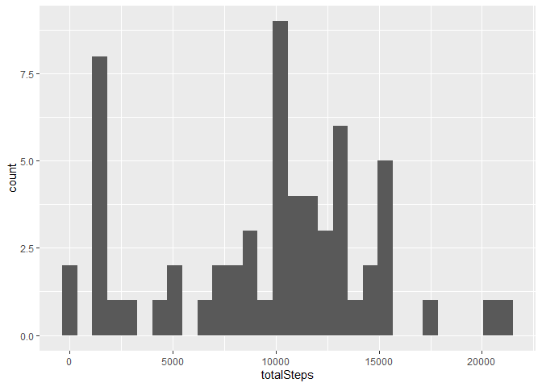

## Introduction 

The purpose of this report is to give a brief description of the data collected by some monitoring device. This device collects data at 5 minute intervals through out the day. The data consists of two months of data from an anonymous individual collected during the months of October and November, 2012 and include the number of steps taken in 5 minute intervals each day.


## Preliminaries 

We'll be using the [`tidyverse`](https://tidyverse.tidyverse.org/) package that loads `ggplot2` and `dplyr` to manage the plots and data manipulation. Also, we won't show any `message` or `warnings` of any output.


```r
knitr::opts_chunk$set(warning=F, message=F)
library(tidyverse)
```

## Loading and Formatting the data

By quick review of the raw data (csv file), we notice that the class of the columns are well formatted. So, we anticipate the class of the columns


```r
colClasses <- c("numeric", "Date", "numeric")
activityData <- read.csv("activity.csv", colClasses = colClasses)
head(activityData)
```

```
##   steps       date interval
## 1    NA 2012-10-01        0
## 2    NA 2012-10-01        5
## 3    NA 2012-10-01       10
## 4    NA 2012-10-01       15
## 5    NA 2012-10-01       20
## 6    NA 2012-10-01       25
```

Also, for each day we create `factor` variable to identify if the day of which the numbers of steps are counted correspond to a weekday or to the weekend.


```r
activityData <- activityData %>% 
        mutate(day = ifelse(weekdays(date) %in% c("sábado", "domingo"),
                            "weekend", "weekday"))
activityData$day <- factor(activityData$day)
summary(activityData)
```

```
##      steps             date               interval           day       
##  Min.   :  0.00   Min.   :2012-10-01   Min.   :   0.0   weekday:12960  
##  1st Qu.:  0.00   1st Qu.:2012-10-16   1st Qu.: 588.8   weekend: 4608  
##  Median :  0.00   Median :2012-10-31   Median :1177.5                  
##  Mean   : 37.38   Mean   :2012-10-31   Mean   :1177.5                  
##  3rd Qu.: 12.00   3rd Qu.:2012-11-15   3rd Qu.:1766.2                  
##  Max.   :806.00   Max.   :2012-11-30   Max.   :2355.0                  
##  NA's   :2304
```

### Mean total number of steps per day

In this step we ignore the `NA` values.


```r
activityData %>% 
        group_by(date) %>% 
        summarise(totalSteps = sum(steps,na.rm = T)) %>%
        ggplot(aes(x = totalSteps)) +
        geom_histogram()
```

<!-- -->

Here is the mean and median value of the total number of steps taken each day.


```r
meanValue <- mean(with(activityData, tapply(steps, date, sum, na.rm = T)))
medianValue <- median(with(activityData, tapply(steps, date, sum, na.rm = T)))
c(meanValue, medianValue)
```

```
## [1]  9354.23 10395.00
```

### Timeserie of the average of steps along days

The following displays a time serie over the intervals and shows the average of steps alongs the days.


```r
auxTable <- activityData %>% 
        group_by(interval) %>%
        summarise(averageSteps = mean(steps, na.rm = T))

maxInterval <- auxTable$interval[which(auxTable$averageSteps == max(auxTable$averageSteps))]

auxTable %>%
        ggplot(aes(x=interval, y=averageSteps)) +
        geom_line() + 
        geom_vline(xintercept = maxInterval, color = "red")
```

<!-- -->

In the interval 835 we reach the maximum of the time serie. This point is marked with red in the previous plot.

### What about missing values?

Clearly, the `steps` columns have some `NA` values.


```r
summary(activityData)
```

```
##      steps             date               interval           day       
##  Min.   :  0.00   Min.   :2012-10-01   Min.   :   0.0   weekday:12960  
##  1st Qu.:  0.00   1st Qu.:2012-10-16   1st Qu.: 588.8   weekend: 4608  
##  Median :  0.00   Median :2012-10-31   Median :1177.5                  
##  Mean   : 37.38   Mean   :2012-10-31   Mean   :1177.5                  
##  3rd Qu.: 12.00   3rd Qu.:2012-11-15   3rd Qu.:1766.2                  
##  Max.   :806.00   Max.   :2012-11-30   Max.   :2355.0                  
##  NA's   :2304
```

So, we inspect how the `NA` are distributed per day (`date` column).


```r
activityData %>% 
        group_by(date) %>% 
        summarise(naCount = sum(is.na(steps))) %>%
        filter(naCount > 0)
```

```
## # A tibble: 8 x 2
##   date       naCount
##   <date>       <int>
## 1 2012-10-01     288
## 2 2012-10-08     288
## 3 2012-11-01     288
## 4 2012-11-04     288
## 5 2012-11-09     288
## 6 2012-11-10     288
## 7 2012-11-14     288
## 8 2012-11-30     288
```

To avoid bias about the missing observations, we fill those values with the median of the observations per interval along the days. 


```r
activityData2 <- activityData %>% 
        group_by(interval) %>% 
        mutate(newSteps = ifelse(is.na(steps), median(steps, na.rm = T), steps))

summary(activityData2)
```

```
##      steps             date               interval           day       
##  Min.   :  0.00   Min.   :2012-10-01   Min.   :   0.0   weekday:12960  
##  1st Qu.:  0.00   1st Qu.:2012-10-16   1st Qu.: 588.8   weekend: 4608  
##  Median :  0.00   Median :2012-10-31   Median :1177.5                  
##  Mean   : 37.38   Mean   :2012-10-31   Mean   :1177.5                  
##  3rd Qu.: 12.00   3rd Qu.:2012-11-15   3rd Qu.:1766.2                  
##  Max.   :806.00   Max.   :2012-11-30   Max.   :2355.0                  
##  NA's   :2304                                                          
##     newSteps  
##  Min.   :  0  
##  1st Qu.:  0  
##  Median :  0  
##  Mean   : 33  
##  3rd Qu.:  8  
##  Max.   :806  
## 
```

What kind of changes we obtained?


```r
activityData2 %>% 
        group_by(date) %>% 
        summarise(totalSteps = sum(newSteps)) %>%
        ggplot(aes(x = totalSteps)) +
        geom_histogram()
```

<!-- -->

Here is the mean and median value of the total number of steps taken each day with the `NA` treatment.


```r
meanValue2 <- mean(with(activityData2, tapply(newSteps, date, sum)))
medianValue2 <- median(with(activityData2, tapply(newSteps, date, sum)))
c(meanValue2, medianValue2)
```

```
## [1]  9503.869 10395.000
```

### Timeserie of the average of steps along weekdays and weekend

The following displays a time serie over the intervals and shows the average of steps alongs the days.


```r
auxTable <- activityData2 %>% 
        group_by(interval, day) %>%
        summarise(averageSteps = mean(newSteps, na.rm = T))

maxInterval <- auxTable$interval[which(auxTable$averageSteps == max(auxTable$averageSteps))]

auxTable %>%
        ggplot(aes(x=interval, y=averageSteps)) +
        geom_line() + 
        facet_grid(.~day)
```

<!-- -->

In the interval 835 we reach the maximum of the time serie. This point is marked with red in the previous plot.

